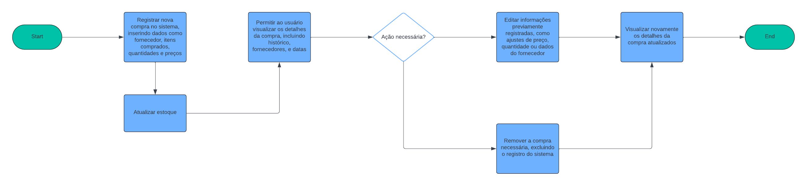
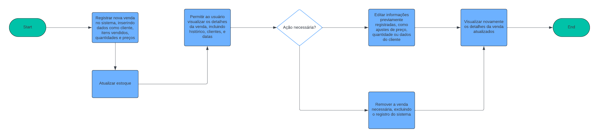
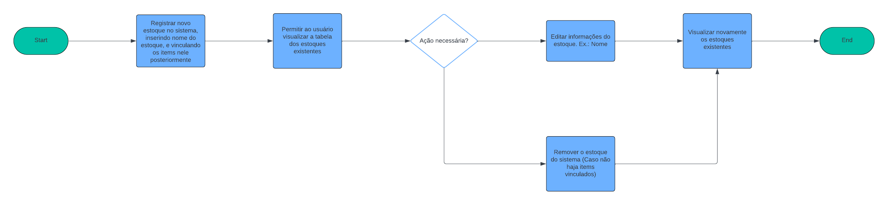
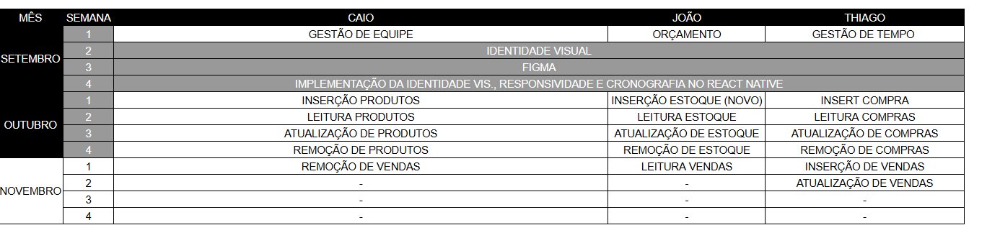
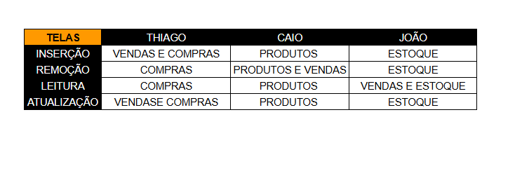
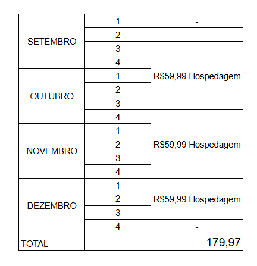

# Especificações do Projeto

Pré-requisitos: <a href="1-Documentação de Contexto.md"> Documentação de Contexto</a>

Definição do problema e ideia de solução a partir da perspectiva do usuário. É composta pela definição do  diagrama de personas, histórias de usuários, requisitos funcionais e não funcionais além das restrições do projeto.

Apresente uma visão geral do que será abordado nesta parte do documento, enumerando as técnicas e/ou ferramentas utilizadas para realizar a especificações do projeto

## Personas

1. Marcos tem 45 anos, é gerente de estoque e trabalha em uma empresa de médio porte. Ele busca otimizar o gerenciamento de estoque para reduzir erros e melhorar a eficiência da equipe. Com vasta experiência na área, Marcos está interessado em sistemas que facilitem o acesso a dados e automatizem processos, permitindo que ele dedique mais tempo à supervisão estratégica.

1. Carla tem 32 anos, é analista de compras em uma grande empresa e é responsável por garantir que o estoque esteja sempre abastecido. Organizada e focada, ela usa a tecnologia para analisar dados e fazer previsões de demanda. Carla procura ferramentas que integrem processos e a ajudem a melhorar o controle e a eficiência das compras.

1. João tem 28 anos e é colaborador operacional em uma empresa de logística. Seu trabalho envolve o controle de entrada e saída de produtos no estoque. João prefere sistemas simples e fáceis de usar, que o ajudem a realizar suas tarefas rapidamente e com menos erros, para que ele possa se concentrar na parte prática do trabalho sem complicações.

## Histórias de Usuários

Com base na análise das personas forma identificadas as seguintes histórias de usuários:

|EU COMO | QUERO/PRECISO |PARA                  |
|--------------------|------------------------------------|----------------------------------------|
|Gerente de Estoque (Marcos, 45 anos)  | Automatizar os processos de controle de estoque para evitar erros manuais e garantir o acesso rápido às informações. | Melhorar a eficiência operacional e reduzir o tempo gasto em tarefas manuais. |
|Analista de Compras (Carla, 32 anos)  | Monitorar a disponibilidade de produtos e ativos para realizar pedidos de reposição de forma ágil. | Otimizar os processos de compra e melhorar a previsão de demanda com base em dados precisos. |
|3. Colaborador Operacional (João, 28 anos) | Ter ferramentas simples e intuitivas para registrar e acompanhar movimentações de estoque. | Reduzir o tempo gasto em tarefas operacionais e facilitar o acesso às informações necessárias para sua função. |

## Modelagem do Processo de Negócio 

### Análise da Situação Atual

Atualmente, muitas empresas, principalmente de pequeno e médio porte, ainda realizam o controle de estoque de forma manual, ou com ERP's cujo foco central não é a automação do processo, mas sim, o controle de informação (para apresentação posterior ao governo e afins). O processo envolve:

- Registro manual de entrada e saída de produtos, frequentemente feito em planilhas ou até mesmo em papel, o que leva a erros humanos, duplicação de dados, e inconsistências.
- Contagem física de inventário sem suporte automatizado, o que causa lentidão e retrabalho durante auditorias e balanços.
- Falta de integração entre as filiais ou departamentos, o que dificulta o compartilhamento de informações em tempo real.
- Dificuldade no acesso a dados históricos e relatórios de desempenho, impedindo uma tomada de decisão rápida e eficiente.

Esse cenário cria um ambiente propenso a falhas, perda de tempo e aumento dos custos operacionais. Além disso, o desgaste dos colaboradores e a ineficiência geral afetam diretamente o desempenho da empresa e sua capacidade de resposta ao mercado.

### Descrição Geral da Proposta

A proposta visa automatizar o processo de gestão de estoque, substituindo os métodos manuais por um sistema integrado que permite:

- Automatização do controle de entrada e saída de produtos, eliminando a necessidade de registros manuais e reduzindo erros.
- Monitoramento em tempo real dos níveis de estoque e movimentações, acessível de qualquer local, integrando filiais e departamentos.
- Relatórios automatizados que fornecem insights sobre o desempenho do estoque, permitindo previsões de demanda e uma gestão mais estratégica.
- Redução do tempo e custo operacional, liberando os colaboradores para focar em tarefas mais estratégicas e menos repetitivas.

A proposta está alinhada com os objetivos do negócio de inovação e sustentabilidade, conforme os ODS 08, 09, 11 e 12, ao otimizar os processos internos e reduzir o desperdício de recursos, tanto humanos quanto materiais. As oportunidades de melhoria incluem um aumento na eficiência operacional, maior controle sobre o estoque, melhor integração entre setores e filiais, e uma tomada de decisão mais informada e ágil.

### Processo 1 – PROCESSO DE COMPRA

Este processo gere as compras do negócio, e atualiza o estoque de acordo com cada uma.  

### Processo 2 – PROCESSO DE VENDA

Este processo gere as vendas do negócio, e atualiza o estoque de acordo com cada uma. 

### Processo 3 – PROCESSO DE CRIAÇÃO, EDIÇÃO, E VISUALIZAÇÃO DE ESTOQUES

Este processo gere os diversos estoques presentes no negócio. 

## Indicadores de Desempenho

## Indicadores de Avaliação

| Indicador                            | Objetivos                                                    | Descrição                                                                                         | Cálculo                                                                                                     | Fonte de Dados                  | Perspectiva                  |
|--------------------------------------|--------------------------------------------------------------|---------------------------------------------------------------------------------------------------|------------------------------------------------------------------------------------------------------------|---------------------------------|------------------------------|
| **Relatos do usuário** | Entender se o sistema está cumprindo os requisitos     | Avaliação da satisfação do usuário por meio de seus relatos.. |  -  | Pesquisa com o usuário (Ex.: via forms) | Satisfação do usuário    |
| **Precisão dos Dados**                | Melhorar a precisão dos dados                                | Avalia a quantidade de erros e inconsistências nos dados registrados pelo sistema automatizado.   | Número de erros nos dados automatizados / Total de registros automatizados                                  | Relatórios de erro, Dados de entrada | Qualidade da Informação       |
| **Tempo de Realização de Inventários** | Acelerar o processo de inventário                            | Mede o tempo gasto para realizar inventários físicos com o sistema comparado ao método manual.     | Tempo médio para concluir o inventário com o sistema - Tempo médio para concluir o inventário manual      | Relatórios de inventário         | Eficiência no Inventário      |
| **Número de Correções e Ajustes**     | Reduzir o número de correções e ajustes                      | Avalia a quantidade de correções e ajustes necessários no sistema automatizado.                   | Número de correções e ajustes no sistema / Total de transações registradas                                  | Registros de ajustes e correções | Precisão e Confiabilidade    |
| **Acesso e Disponibilidade de Informações** | Melhorar o acesso e a disponibilidade das informações         | Mede a facilidade e a rapidez no acesso às informações sobre compras, vendas e estoque.           | Tempo médio de acesso às informações com o sistema - Tempo médio de acesso manual                         | Sistema de gestão, Feedback dos usuários | Acesso e Usabilidade         |

## Requisitos

As tabelas que se seguem apresentam os requisitos funcionais e não funcionais que detalham o escopo do projeto. Para determinar a prioridade de requisitos, aplicar uma técnica de priorização de requisitos e detalhar como a técnica foi aplicada.

## Requisitos Funcionais

| ID   | Requisito                                                          | Descrição                                                                                   |
|------|--------------------------------------------------------------------|---------------------------------------------------------------------------------------------|
| RF01 | **Lançamento de Compras**                                          | O sistema deve permitir o registro de novas compras.                                       |
| RF02 | **Visualização de Compras**                                        | O sistema deve permitir a visualização detalhada dos registros de compras.                 |
| RF03 | **Edição de Compras**                                              | O sistema deve permitir a atualização dos registros de compras existentes.                 |
| RF04 | **Remoção de Compras**                                             | O sistema deve permitir a exclusão de registros de compras.                                |
| RF05 | **Lançamento de Vendas**                                           | O sistema deve permitir o registro de novas vendas.                                        |
| RF06 | **Visualização de Vendas**                                         | O sistema deve permitir a visualização detalhada dos registros de vendas.                  |
| RF07 | **Edição de Vendas**                                               | O sistema deve permitir a atualização dos registros de vendas existentes.                 |
| RF08 | **Remoção de Vendas**                                              | O sistema deve permitir a exclusão de registros de vendas.                                 |
| RF09 | **Lançamento de Produto no Estoque**                                          | O sistema deve permitir o registro de novos itens no estoque.                              |
| RF10 | **Visualização de Estoque**                                        | O sistema deve permitir a visualização detalhada dos registros de estoque.                 |
| RF11 | **Edição de Estoque**                                              | O sistema deve permitir a atualização dos registros de estoque existentes.                |
| RF12 | **Remoção de Estoque**                                             | O sistema deve permitir a exclusão de registros de estoque.                                |
| RF13 | **Controle Automático de Nível de Estoque**                        | O sistema deve ajustar automaticamente os níveis de estoque com base nas compras e vendas.  |

## Requisitos Não Funcionais

| ID   | Requisito                                                          | Descrição                                                                                   |
|------|--------------------------------------------------------------------|---------------------------------------------------------------------------------------------|
| RNF01| **Usabilidade**                                                    | O sistema deve ter uma interface intuitiva e fácil de usar.                                |
| RNF02| **Desempenho**                                                     | O sistema deve realizar todas as operações rapidamente, mesmo com grandes volumes de dados.|
| RNF03| **Segurança**                                                      | O sistema deve proteger os dados contra acessos não autorizados e garantir a integridade das informações. |
| RNF04| **Confiabilidade**                                                 | O sistema deve ser estável e garantir a continuidade das operações sem falhas.             |
| RNF05| **Custo**                                                           | O sistema deve ter um custo acessível e adequado para diferentes tamanhos de empresa.       |
| RNF06| **Manutenibilidade**                                               | O sistema deve ser fácil de manter e atualizar, com suporte técnico e documentação clara.   |

## Restrições

O projeto está restrito pelos itens apresentados na tabela a seguir.

|ID| Restrição                                             |
|--|-------------------------------------------------------|
|01| O projeto deverá ser entregue até o final do semestre |
|02| Usar Banco NoSQL |
|03| Utilização de React Native |

## Diagrama de Casos de Uso

# Matriz de Rastreabilidade

| Requisito Funcional                       | Usabilidade (RNF01) | Desempenho (RNF02) | Segurança (RNF03) | Confiabilidade (RNF04) | Custo (RNF05) | Manutenibilidade (RNF06) |
|-------------------------------------------|---------------------|--------------------|-------------------|------------------------|---------------|--------------------------|
| RF01 - Lançamento de Compras              | X                   | X                  | X                 | X                      |               | X                        |
| RF02 - Visualização de Compras            | X                   | X                  |                   |                        |               |                          |
| RF03 - Edição de Compras                  | X                   | X                  | X                 | X                      |               | X                        |
| RF04 - Remoção de Compras                 |                     |                    | X                 |                        |               | X                        |
| RF05 - Lançamento de Vendas               | X                   | X                  | X                 | X                      |               | X                        |
| RF06 - Visualização de Vendas             | X                   | X                  |                   |                        |               |                          |
| RF07 - Edição de Vendas                   | X                   | X                  | X                 | X                      |               | X                        |
| RF08 - Remoção de Vendas                  |                     |                    | X                 |                        |               | X                        |
| RF09 - Lançamento de Produto no Estoque   | X                   | X                  | X                 | X                      |               | X                        |
| RF10 - Visualização de Estoque            | X                   | X                  |                   |                        |               |                          |
| RF11 - Edição de Estoque                  | X                   | X                  | X                 | X                      |               | X                        |
| RF12 - Remoção de Estoque                 |                     |                    | X                 |                        |               | X                        |
| RF13 - Controle Automático de Nível de Estoque |                   | X                  |                   | X                      |               | X                        |

# Gerenciamento de Projeto

## Gerenciamento de Tempo

Com diagramas bem organizados que permitem gerenciar o tempo nos projetos, o gerente de projetos agenda e coordena tarefas dentro de um projeto para estimar o tempo necessário de conclusão.

## Gerenciamento de Equipe

O gerenciamento adequado de tarefas contribuirá para que o projeto alcance altos níveis de produtividade. Por isso, é fundamental que ocorra a gestão de tarefas e de pessoas, de modo que os times envolvidos no projeto possam ser facilmente gerenciados. 

## Gestão de Orçamento

O processo de determinar o orçamento do projeto é uma tarefa que depende, além dos produtos (saídas) dos processos anteriores do gerenciamento de custos, também de produtos oferecidos por outros processos de gerenciamento, como o escopo e o tempo.

